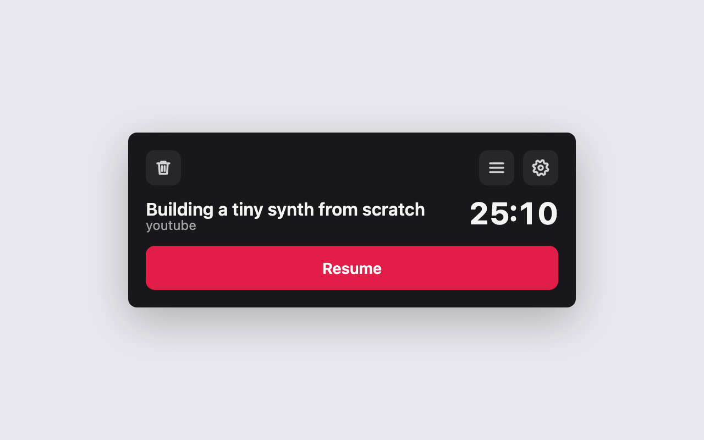
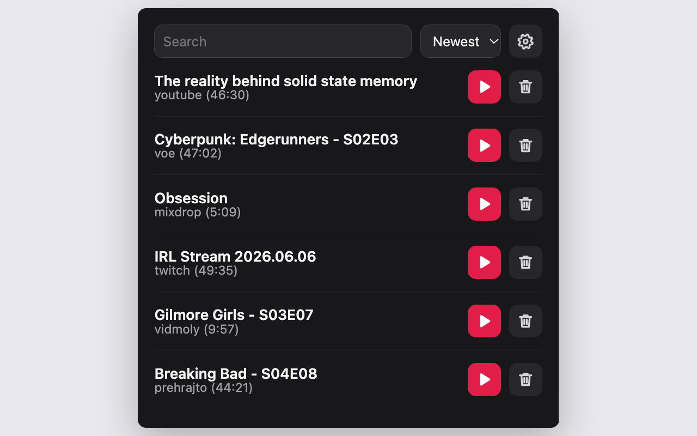

# Rezumer
Firefox extension that remembers how far you got in a video.

 

- Saves your position while you watch and shows it when you come back.
- Resume on YouTube, Twitch and Prehraj.to. On Android it shows as a card on the page.
- Lists everything you've watched, with search and sorting.

**Supported:** YouTube, Twitch (VODs), Prehraj.to, Filemoon, Vidmoly, Mixdrop, Voe.

## Develop
Load `manifest.json` in `about:debugging#/runtime/this-firefox` (Firefox 149+). Build with `npx web-ext build`. To release, bump `version` in `manifest.json` and push a matching `v` tag.
